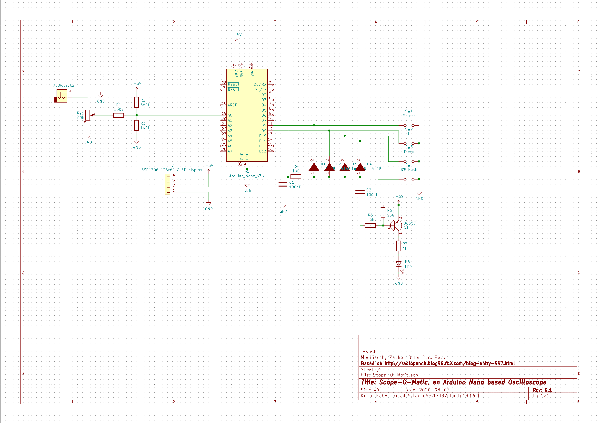
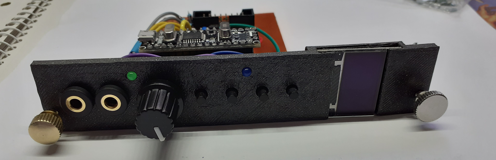
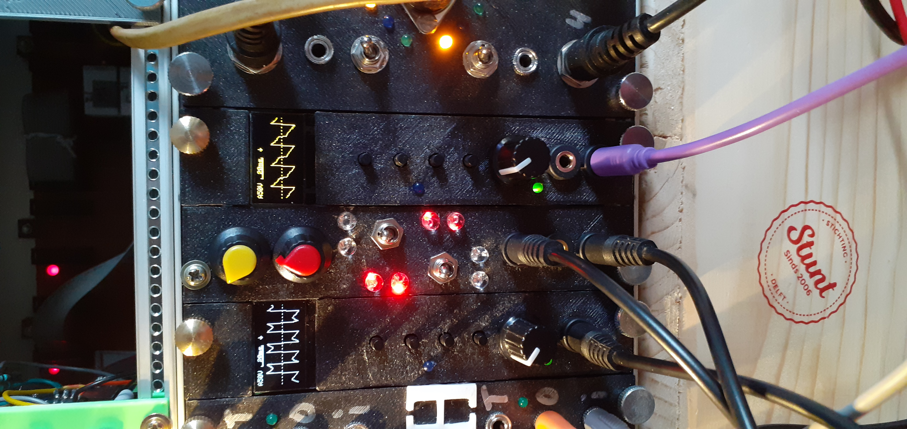
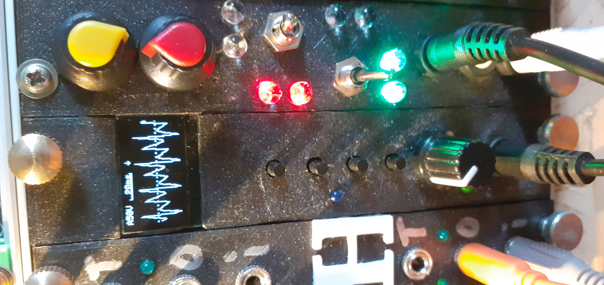

# Scope-O-Matic

An arduino nano oscilloscope in Euro Rack format based on a design described in this blog: http://radiopench.blog96.fc2.com/blog-entry-997.html

The code the arduino runs is based on software version 2.0. You will need an arduino nano with an Atmel ATMega 328p for this (Note: a 168p does not have enough memory for the program). Changes made to the code simplify what is displayed on the screen. The use case this was done for is to have a simple wave display that shows the waveform of signals used in a Euro Rack modular systhesis system. The original code is still there, it just does not show that much info anymore as I was only interested in the waveform and not in doing exact measurements. The changes are implemented as #define statements so can be easily adapted to your need. Have a look at the code and you will find that there is a normal and a simplified profile.

The electronics were adapted from the original circuit diagram so that they are able to show AC-signals as well.

In this video you can see 2 oscilloscopes in action: https://www.youtube.com/watch?v=wOnTNtAUl_A
